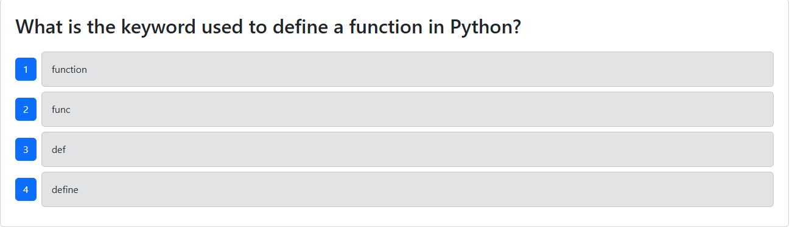

# Tech Quiz

## Description 
In today's dynamic development environment, testing is not just an afterthought but a critical part of the development process that ensures applications meet user demands and perform efficiently under various conditions.

This week, you'll take the starter codebase of a fully functioning Tech Quiz application and enhance it by adding Cypress for both component and end-`to-end tests. The app was built using the MERN stack with a React front end, MongoDB database, and Node.js/Express.js server and API.

## Table of Contents
- [Description](#description)
- [Installation](#installation)
- [Usage](#usage)
- [Contributing](#contributing)
- [Tests](#tests)
- [Questions](#questions)

## Installation
Download it from 'code', don't forget to "npm i"

## Usage
It allows users to take a quiz of ten random questions and view their final score.

Your testing should use [Cypress](https://docs.cypress.io/guides/overview/why-cypress) to run both the component tests and the end-to-end tests. The testing will be invoked using the following command:

```bash
npm run test
```

## Contributing
Amauri

## Tests
A lot.

## Video Walkthrough 
[](https://drive.google.com/file/d/1pUgzicfAL2u7cN-ZluQ6VAA38NrMnpVM/view?usp=sharing)

## Questions
For more personal questions, contact me at github.com/Amauri817
or email me @ brownamauri@icloud.com, I will try to reply as soon as I can.

## Acceptance Criteria
```
GIVEN I am taking a tech quiz
WHEN I click the start button
THEN the quiz starts and I am presented with a question
WHEN I answer a question
THEN I am presented with another question
WHEN all questions are answered
THEN the quiz is over
WHEN the quiz is over
THEN I can view my score
WHEN the quiz is over
THEN I can start a new quiz
```